<p align="center">
  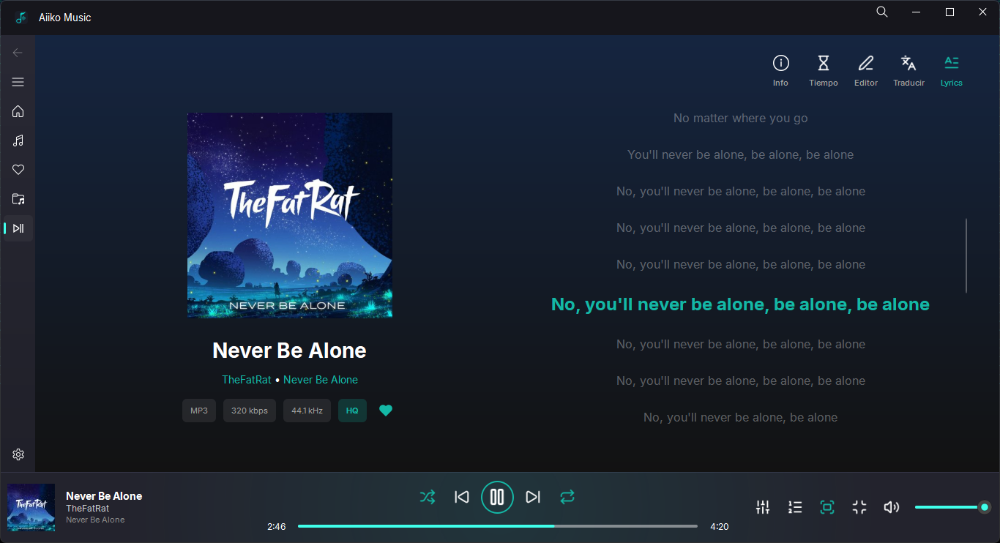
</p>

<h1 align="center">Aiiko Music</h1>

<p align="center">
  A desktop music player for your own music library.
</p>

<p align="center">
Aiiko Music is a local music player for Windows, designed around personal music collections. It brings playback, albums, artists, playlists, lyrics and metadata together in one place.
</p>

## Features

- Local music library
- Album and artist browsing
- Playlist management
- 10-band equalizer
- Queue and shuffle playback
- Gapless playback
- Lyrics support, including `.lrc` files and online lyrics finder
- Metadata editor
- Album artwork
- Audio visualizer
- Discord Rich Presence
- Keyboard shortcuts
- Library-wide search
- Floating mini player
- Appearance and accent customization
- Last.fm scrrobbling
- Lyrics editor
- Fullscreen viewer

## Screenshots

<p align="center">
  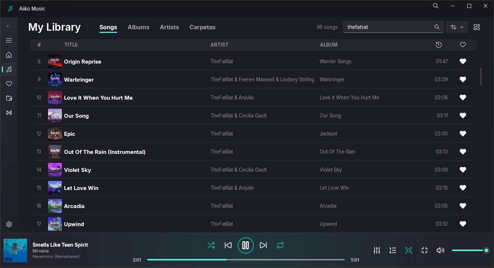
  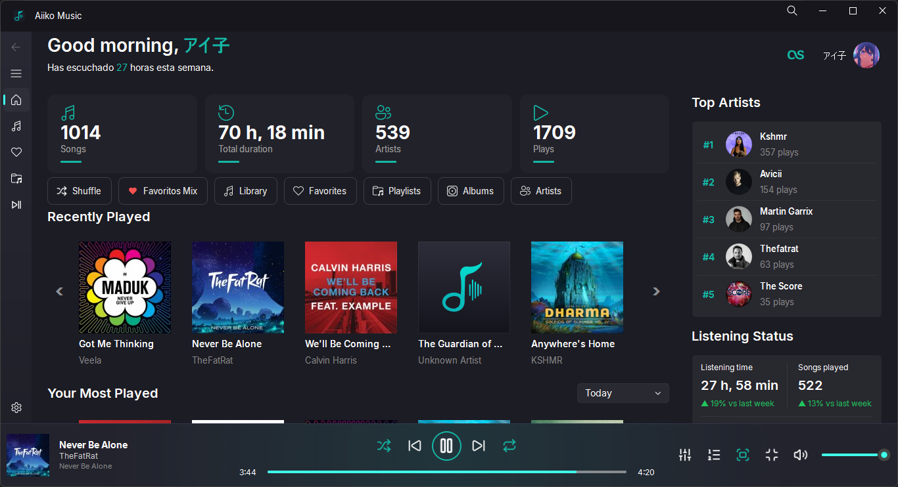
</p>

<p align="center">
  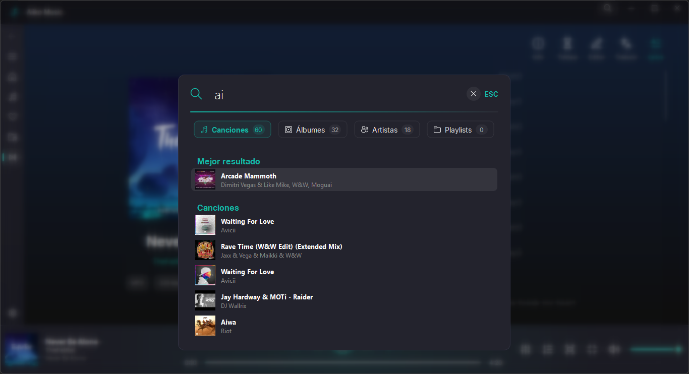
  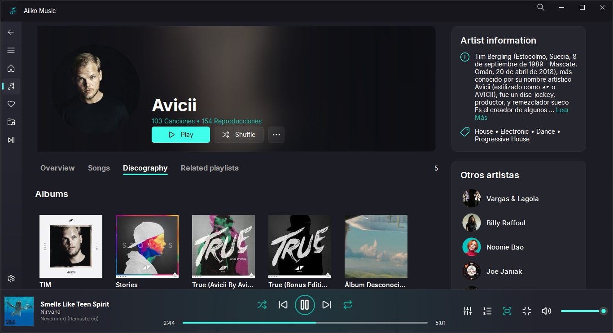
</p>

<p align="center">
  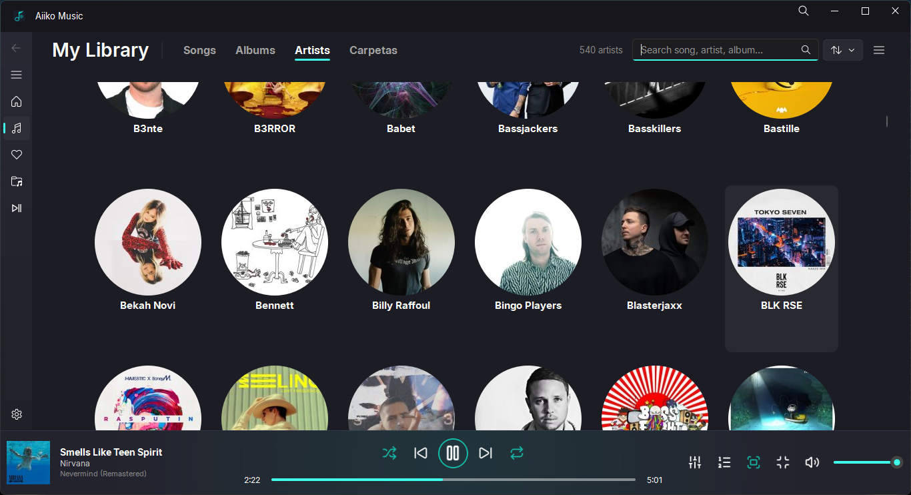
  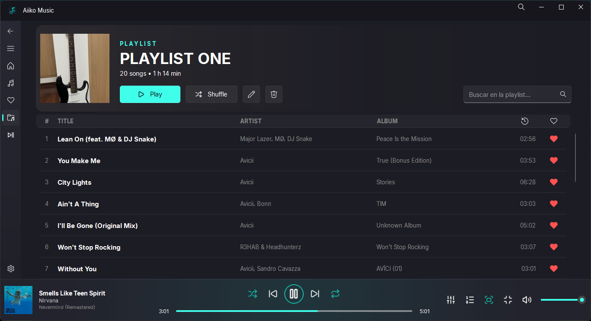
</p>

## Lyrics editor

Advanced lyrics editor and search tool

<p align="center">
  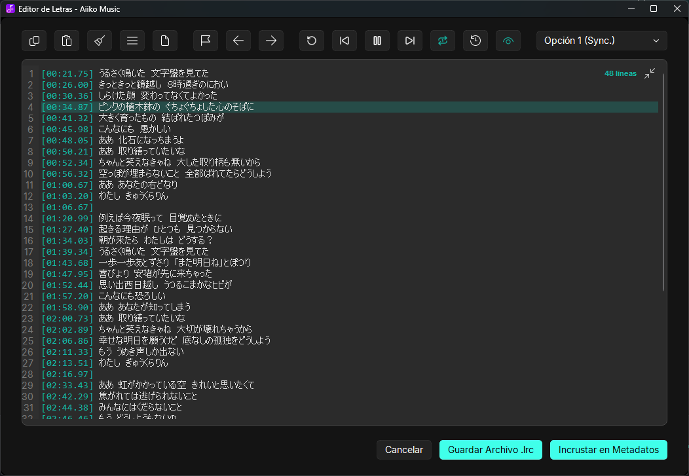
</p>

## Supported Audio

Aiiko Music supports common audio formats through its playback engine, including:

<p>
  &nbsp;&nbsp;&nbsp;
  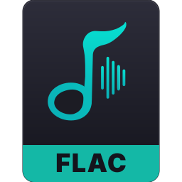&nbsp;&nbsp;&nbsp;
  &nbsp;&nbsp;&nbsp;
  &nbsp;&nbsp;&nbsp;
  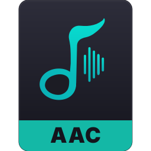&nbsp;&nbsp;&nbsp;
  &nbsp;&nbsp;&nbsp;
  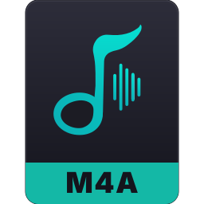
</p>

Format support may depend on the capabilities of the playback engine.

## Built With

Aiiko Music is built with Python and Qt.

- [PyQt6](https://www.riverbankcomputing.com/software/pyqt/)
- [PyQt-Fluent-Widgets](https://github.com/zhiyiYo/PyQt-Fluent-Widgets)
- [PyQt-Frameless-Window](https://github.com/zhiyiYo/PyQt-Frameless-Window)
- [BASS](https://www.un4seen.com/bass.html)
- [Mutagen](https://mutagen.readthedocs.io/)
- [pyqtgraph](https://www.pyqtgraph.org/)
- [Pillow](https://python-pillow.org/)

Check requeriments.txt

Third-party libraries and components are maintained by their respective authors and are subject to their own licenses.

## Installation & Download - Windows 10 & 11

The easiest way to use Aiiko Music is to download the latest release:

[Download Aiiko Music](https://github.com/HirayamaAiiko/Aiiko-Music/releases)

1. Extract the zip file to a folder.

2. Launch the .exe and follow the on-screen prompts that the app displays upon first launch.

To run the project from source:

```bash
git clone https://github.com/HirayamaAiiko/Aiiko-Music.git
cd Aiiko-Music
pip install -r requirements.txt
python main.py
```

Aiiko Music currently targets Windows.

## Languages (WIP)

Currently limited in implementation and built based on my own Spanish language skills; it includes French and English, though some parts of the interface remain incomplete.

## BASS Licensing

Aiiko Music uses **BASS** by Un4seen Developments Ltd. for audio playback.

BASS is free for non-commercial use. Commercial distribution requires an appropriate BASS license.

Please refer to the [BASS licensing terms](https://www.un4seen.com/bass.html) before redistributing Aiiko Music commercially.

## License

Aiiko Music is licensed under the **GNU General Public License v3.0**.

See [`LICENSE`](LICENSE) for the complete license text.

Third-party components used by Aiiko Music remain subject to their respective licenses. BASS, in particular, is distributed under separate licensing terms and is not covered by the GPL.

## Credits

Aiiko Music is developed by **Aiiko Hirayama**.

Thanks to the authors and maintainers of the open-source projects and libraries used by Aiiko Music.

---

**Aiiko Music v1.0.1**

[Repository](https://github.com/HirayamaAiiko/Aiiko-Music) · [Releases](https://github.com/HirayamaAiiko/Aiiko-Music/releases) · [Issues](https://github.com/HirayamaAiiko/Aiiko-Music/issues)
